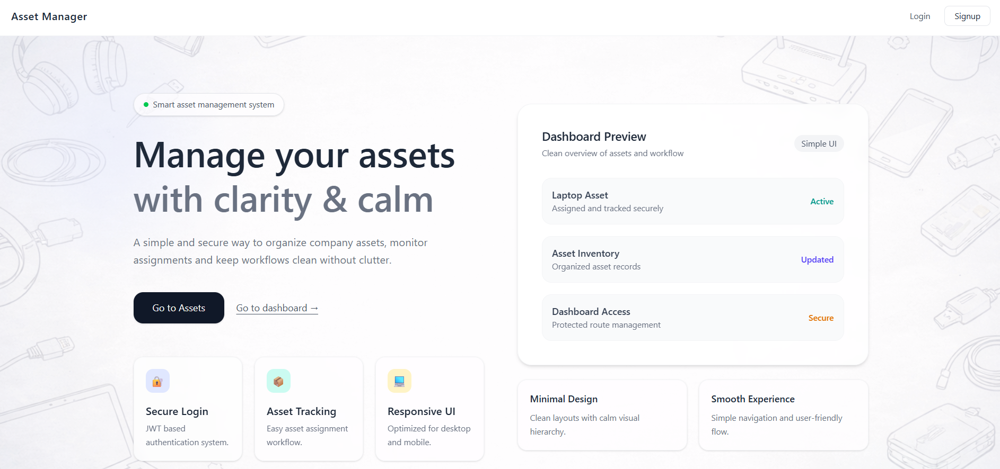
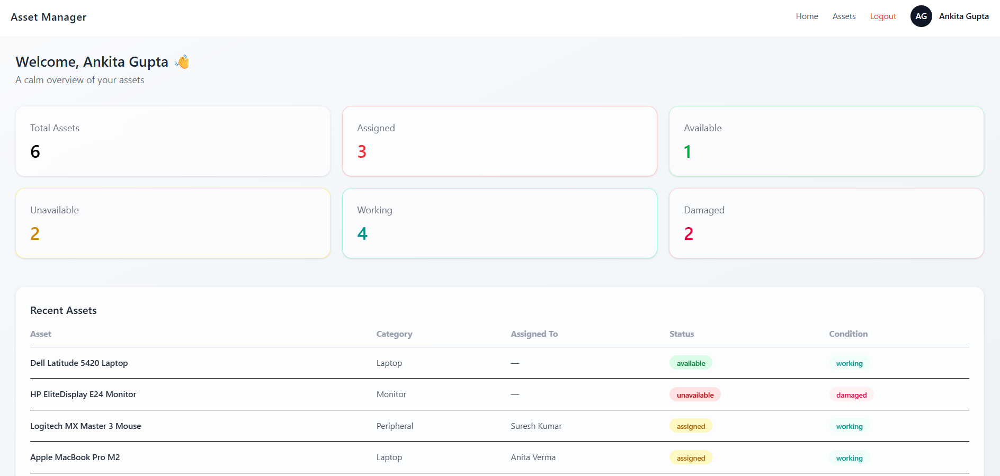
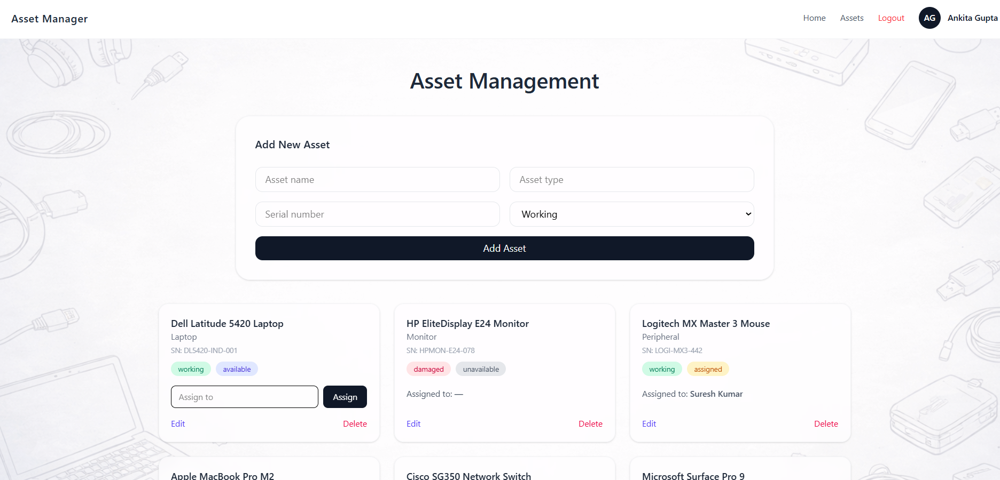
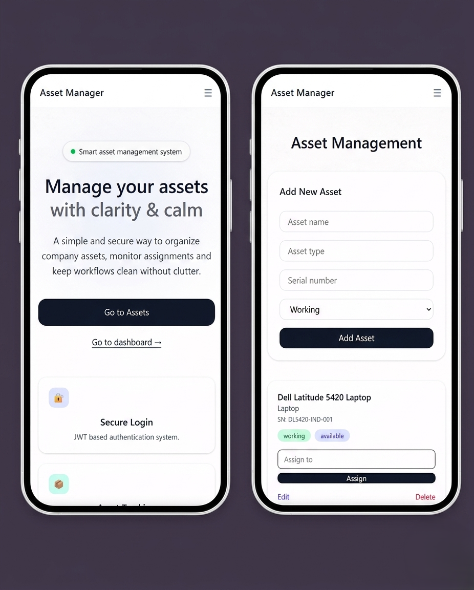

# Asset Management System

A full stack MERN application designed to manage, assign, and track organizational assets efficiently in real time. The system centralizes asset records, improves visibility, and reduces manual tracking efforts through an intuitive dashboard interface.

## Tech Stack


* Frontend: React.js, React Router, Tailwind CSS

* Backend: Node.js, Express.js

* Database: MongoDB

* Other Tools: JWT Authentication, RESTful APIs, Fetch API


## HomePage




## System Workflow

1. Admin logs in securely.

2. Assets are added with details like name, type, serial number, and condition.

3. Assets can be assigned to users.

4. System updates asset status automatically.

5. Dashboard reflects real time counts and assignment data.

## Features

✔ Add, update, and delete assets

✔ Secure JWT Authentication and Login

✔ Assign assets to users

✔ Track asset status (Available, Assigned, Unavailable)

✔ Dashboard with asset counts and assignment overview

✔ Responsive and modern UI using Tailwind CSS

## Project Structure

asset-management-system/

├── frontend/    # React frontend

├── backend/    # Node + Express backend

└── README.md

## Installation

### Clone the repository

```bash
git clone https://github.com/ankita-gupta83/asset-management-system.git
```

### Install frontend dependencies

```bash
cd frontend
npm install
```

### Install backend dependencies

```bash
cd ../backend
npm install
```

### Setup Environment Variables

Create a `.env` file inside the backend folder and add:

```env
PORT=5000
MONGO_URI=your_mongodb_connection
JWT_SECRET=your_secret_key
```

### Run the project

Frontend:

```bash
cd frontend
npm run dev
```

Backend:

```bash
cd backend
npm start
```

## Impact

- Built a responsive dashboard for centralized asset management

- Implemented secure JWT based authentication

- Designed RESTful APIs for asset operations

- Developed workflows for asset allocation, tracking, and availability monitoring

## Screenshots

### Dashboard


### Assets Management


### Mobile Preview



## Future Improvements

* Role based access (Admin / User)

* Asset maintenance tracking

* Export reports in PDF/Excel

* Employee Database to track on employee details

## Author
Ankita Gupta

## Connect With Me
GitHub: https://github.com/ankita-gupta83

LinkedIn: https://www.linkedin.com/in/ankita-gupta004/